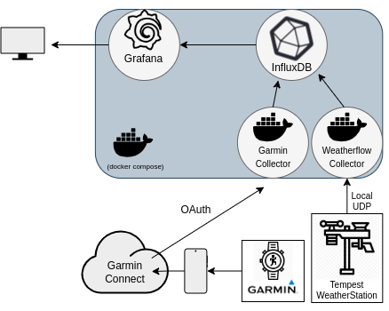

# insight-stack
My stack of self-hosted data services for ingesting, processing, and presenting real-time data insights via Grafana dashboards.
 
## Credits
This repo is built from public repositories forked and modified to suit my needs. The original authors are credited below:
- [arpanghosh8453/garmin-grafana](https://github.com/arpanghosh8453/garmin-grafana)
- [lux4rd0/weatherflow-collector](https://github.com/lux4rd0/weatherflow-collector)

# Stack Hardware
This stack is geared towards the sensors I have available, and can be expected to grow/change along with whom it tracks. 

## Pending additions
- Aranet4 air quality monitor
    - Collector is working as a [python script](https://github.com/Anrijs/Aranet4-Python/tree/master), but needs to be containerized (while maintaining bluetooth connectivity). 
- TickTick task manager
    - API available with many repos, need to find timeseries collector and/or InfluxDB implementation.
- Body Scale
    - Confirm if going to run through Garmin Connect or if better routes. 

## Current Required Hardware
- Garmin device with Garmin Connect enabled.
- Weatherflow-Tempest device with Weatherflow API enabled.

## Tested Hardware
- Garmin Instinct 2 Solar
- Tempest Weather Station

## Stack Components

